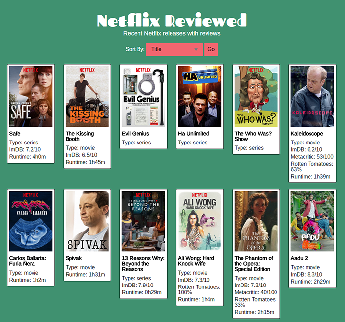

# Netflix Reviewed

## Live App:

[https://jmpainter.github.io/netflix-reviewed/](https://jmpainter.github.io/netflix-reviewed/)

## Summary:

Netflix Reviewed is a resource for combining recent Netflix releases with third party rating information. Users see a series of thumbnail images with rating and runtime information. Ratings from IMDB, Rotten Tomatoes, and Metacritic are provided for each title if available. The list can be sorted by rating type, title, or runtime.  A detail screen with a larger image, if available, and a synopsis is provided when the user selects a title.

## Motivation:

I created this because while Netflix has its’ own rating system, it does not provide third party rating information. I find critic consensus review information such as Rotten Tomatoes very helpful in making decisions about what titles to choose and feel that it is inconvenient to look this information up for each title. This app also provides a quick way to see recent Netflix releases.

## Technologies Used:

This app is front-end only and uses html, css, and ajax with javascript and jquery. The uNoGS api is used for information about Netflix new releases. This is used because Netflix no longer provides a public API. The Open Movie Database API is used to provide the rating information for each title.

## Screenshots:

Home screen:

Detail screen:

## Author:

Josh Painter

